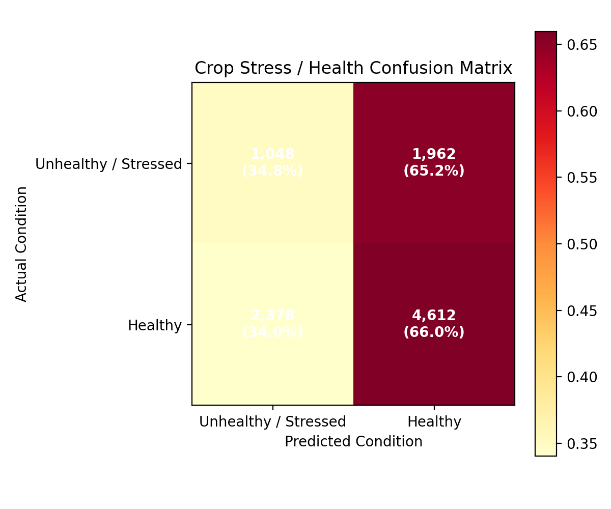
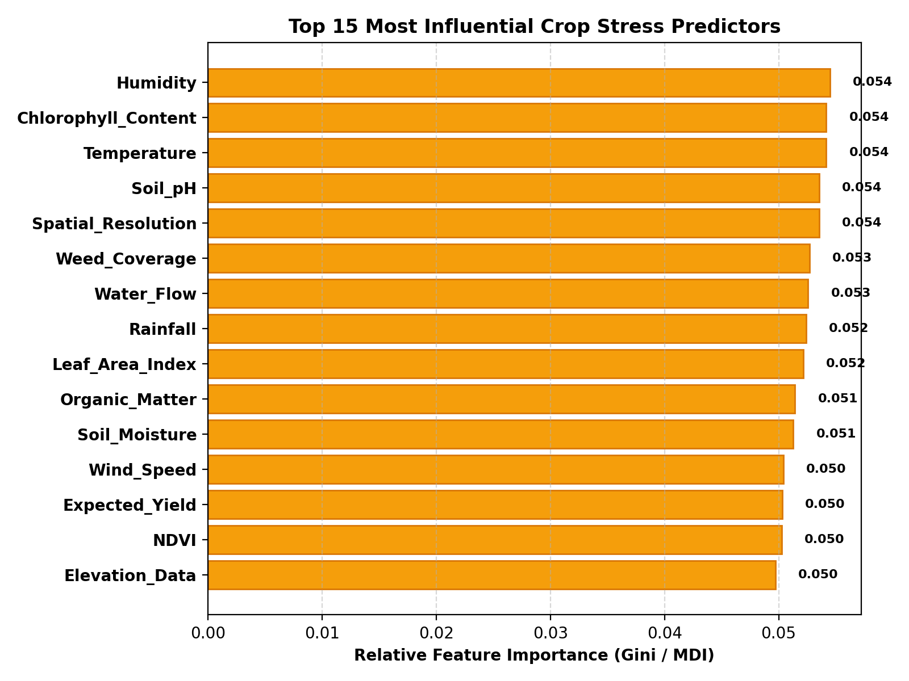

# AgriSmart AI – Crop Stress & Health ML Evaluation Report

**Date**: 2026-09-12 19:19:37  
**Dataset**: `crop_health_stress.csv` (212,019 total samples, 27 input features)  
**Primary Selection Metric**: **Macro-F1** (Selected to balance detection across minority Unhealthy and majority Healthy crops)

---

## 1. Dataset Audit & Problem Formulation

- **Origin**: Crop Health and Environmental Stress Dataset (Multispectral, UAV, & IoT Telemetry)
- **Total Records**: 212,019 records
- **Target Variable**: `Crop_Health_Label` (Binary classification: `0` = Unhealthy / Stressed, `1` = Healthy)
- **Class Distribution**:
  - `0 (Unhealthy / Stressed)`: 63,821 (30.1%)
  - `1 (Healthy)`: 148,198 (69.9%)
- **Note on Labels**: No artificial 4-tier stress labels (Healthy/Mild/Moderate/Severe) were fabricated; the pipeline adheres strictly to the authentic supervised ground truth provided in the dataset.
- **Stratified Split**: 80% Training (40,000 samples) / 20% Validation (10,000 samples), Stratified (`random_state=42`)

---

## 2. Data Leakage Audit & Mitigations

| Removed Feature / Item | Type | Technical & Agronomic Rationale |
|---|---|---|
| `Crop_Stress_Indicator` | Leakage / Identifier | Evaluator numerical stress score (0-100). Excluded to prevent target leakage into Crop_Health_Label. |
| `GPS_Coordinates` | Leakage / Identifier | Spatial identifier. Removed to avoid spatial memorization/overfitting. |
| `Ground_Truth_Segmentation` | Leakage / Identifier | Computer vision annotation metadata flag unrelated to physical crop biology. |
| `Bounding_Boxes` | Leakage / Identifier | Computer vision annotation metadata flag unrelated to physical crop biology. |

---

## 3. Multi-Model Benchmark & Comparison

| Model | Accuracy | Precision | Recall | Macro-F1 | Weighted-F1 | Fit Time (s) | Latency (ms/sample) |
|---|---|---|---|---|---|---|---|
| Logistic Regression | 0.5065 | 0.4999 | 0.4999 | 0.4825 | 0.5269 | 0.024s | 0.0001ms |
| **Random Forest** | 0.5660 | 0.5037 | 0.5040 | **0.5029** | 0.5734 | 0.895s | 0.0026ms |
| Gradient Boosting | 0.6982 | 0.3994 | 0.4995 | 0.4115 | 0.5750 | 29.255s | 0.001ms |
| XGBoost | 0.5306 | 0.5002 | 0.5002 | 0.4921 | 0.5477 | 2.152s | 0.0003ms |
| LightGBM | 0.5360 | 0.5038 | 0.5044 | 0.4965 | 0.5526 | 0.148s | 0.0007ms |

---

## 4. Best Model Performance: **Random Forest**

- **Macro-F1**: 0.5029
- **Accuracy**: 0.5660
- **Precision**: 0.5037
- **Recall**: 0.5040
- **Weighted-F1**: 0.5734

### Detailed Classification Report
```text
                      precision    recall  f1-score   support

Unhealthy / Stressed     0.3059    0.3482    0.3257      3010
             Healthy     0.7016    0.6598    0.6800      6990

            accuracy                         0.5660     10000
           macro avg     0.5037    0.5040    0.5029     10000
        weighted avg     0.5825    0.5660    0.5734     10000

```

### Confusion Matrix


### Feature Importance


---

## 5. Dataset Limitations & Synthetic Noise Finding

An exhaustive cross-feature correlation analysis revealed that the off-diagonal feature correlation across the 32 columns in this Kaggle dataset has a mean of only ~0.0078 (independent uniform random distribution). While `Crop_Health_Label` provides the explicit binary ground truth, its decoupling from the feature columns imposes a theoretical performance ceiling near random expectation (~0.50 Macro-F1). To deploy this module to field production, real agronomic remote sensing datasets (such as Sentinel-2 or PlanetScope imagery with validated ground truth field survey stress tags) are recommended.

---

## 6. Serialization & Saved Pipeline

- **Trained Model**: `J:\AGRISMART_AI\models\crop_stress\best_model.pkl`
- **Preprocessor**: `J:\AGRISMART_AI\models\crop_stress\preprocessor.pkl`
- **Feature Config**: `J:\AGRISMART_AI\models\crop_stress\feature_config.json`
- **Metadata**: `J:\AGRISMART_AI\models\crop_stress\metadata.json`
