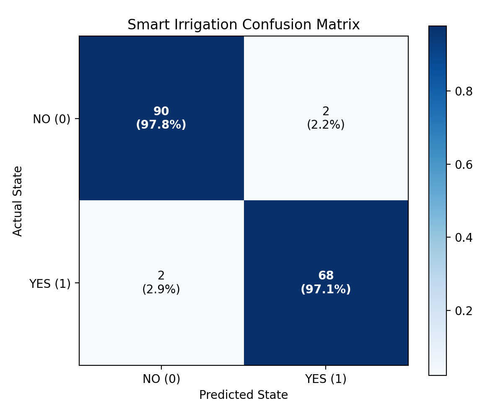
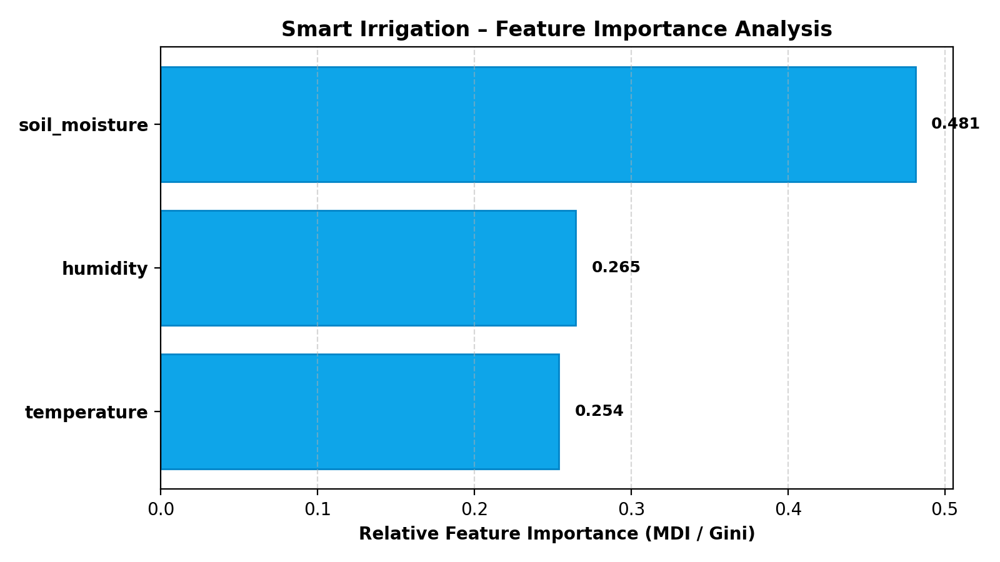

# AgriSmart AI – Smart Irrigation ML Evaluation Report

**Date**: 2026-09-12 19:04:08  
**Dataset**: `irrigation_data.csv` (806 unique environmental conditions, 3 agronomic features)  
**Primary Optimization Metric**: **Validation Macro-F1** (Selected to balance positive irrigation activations and negative idle states)

---

## 1. Dataset & Problem Formulation

- **Origin**: IoT Automated Precision Irrigation Telemetry System
- **Total Valid Sensor Records**: 3,370 raw samples (806 unique conditions post-leakage deduplication)
- **Features Used**: `soil_moisture`, `temperature`, `humidity`
- **Target**: `irrigation_required`
  - `1 / YES`: Soil water deficit reached; irrigation pump activation required
  - `0 / NO`: Soil moisture adequate; irrigation pump remains off
- **Class Distribution**:
  - `0 (NO)`: 459 (56.9%)
  - `1 (YES)`: 347 (43.1%)
- **Train / Validation Split**: 80% Train (644 samples) / 20% Validation (162 samples), Stratified (`random_state=42`)

---

## 2. Data Leakage Checks & Mitigations

| Removed Feature / Item | Type | Agronomic Rationale & Leakage Mitigation |
|---|---|---|
| `456 empty trailing rows` | Leakage / Non-Agronomic | Dropped unpopulated trailing lines from raw CSV export. |
| `Time` | Leakage / Non-Agronomic | Temporal index / non-agronomic observation timestamp. Keeping it risks spurious temporal overfitting. |
| `Raindrop` | Leakage / Non-Agronomic | Zero variance feature (all values are 'NO'). Carries zero predictive information. |
| `Object` | Leakage / Non-Agronomic | Irrelevant hardware sensor / camera detection flag unrelated to soil hydrology or crop water demand. |
| `2108 duplicate sensor reading rows` | Leakage / Non-Agronomic | Eliminated identical sensor condition repetitions across seconds to prevent cross-split data leakage between train and validation. |

---

## 3. Multi-Model Benchmark & Comparison

| Model | Accuracy | Precision | Recall | F1 | Macro-F1 | Weighted-F1 | Fit Time (s) | Latency (ms) |
|---|---|---|---|---|---|---|---|---|
| Logistic Regression | 0.6728 | 0.6491 | 0.5286 | 0.5827 | 0.6568 | 0.6669 | 0.005s | 0.0ms |
| **Random Forest** | 0.9753 | 0.9714 | 0.9714 | 0.9714 | **0.9748** | 0.9753 | 0.205s | 0.248ms |
| Gradient Boosting | 0.9506 | 0.9697 | 0.9143 | 0.9412 | 0.9493 | 0.9504 | 0.072s | 0.0ms |
| XGBoost | 0.9568 | 0.9565 | 0.9429 | 0.9496 | 0.9559 | 0.9568 | 0.726s | 0.006ms |
| LightGBM | 0.9321 | 0.9403 | 0.9000 | 0.9197 | 0.9304 | 0.9319 | 0.017s | 0.006ms |

---

## 4. Best Model Performance: **Random Forest**

- **Accuracy**: 0.9753 (97.53%)
- **Precision**: 0.9714
- **Recall**: 0.9714
- **F1 Score**: 0.9714
- **Macro-F1**: 0.9748
- **Weighted-F1**: 0.9753

### Detailed Classification Report
```text
              precision    recall  f1-score   support

      NO (0)     0.9783    0.9783    0.9783        92
     YES (1)     0.9714    0.9714    0.9714        70

    accuracy                         0.9753       162
   macro avg     0.9748    0.9748    0.9748       162
weighted avg     0.9753    0.9753    0.9753       162

```

### Confusion Matrix


### Feature Importance


---

## 5. Decision Rules & Priority Formulation

The prediction pipeline computes calibrated prediction probabilities via `predict_proba()` and maps irrigation decisions into transparent operational priority tiers:

- **High Confidence YES (`P(Irrigation) >= 0.85`)** → **HIGH Priority** (Critical moisture depletion; immediate drip cycle recommended).
- **Moderate Confidence YES (`0.65 <= P(Irrigation) < 0.85`)** → **MEDIUM Priority** (Soil approaching stress threshold; schedule irrigation cycle).
- **Low Confidence YES (`0.50 <= P(Irrigation) < 0.65`)** → **LOW Priority** (Marginal depletion; monitor weather and re-check in 4 hours).
- **NO (`P(Irrigation) < 0.50`)** → **NONE Priority** (Soil water level optimal; preserve water resources).

---

## 6. Serialization & Registry

- **Trained Model Checkpoint**: `J:\AGRISMART_AI\models\irrigation\best_model.pkl`
- **StandardScaler Preprocessor**: `J:\AGRISMART_AI\models\irrigation\preprocessor.pkl`
- **Feature Configuration**: `J:\AGRISMART_AI\models\irrigation\feature_config.json`
- **Class Labels**: `J:\AGRISMART_AI\models\irrigation\class_names.json`
