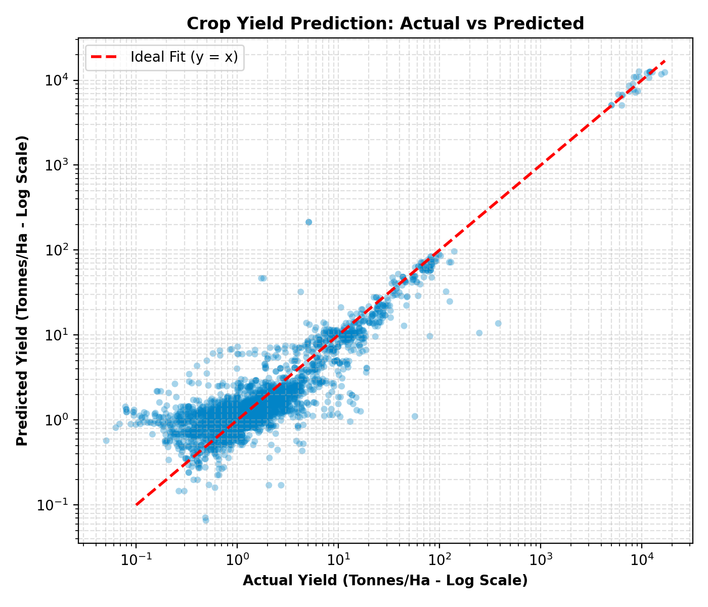
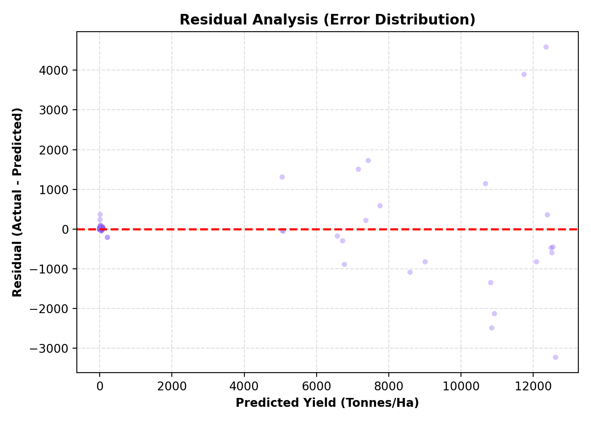
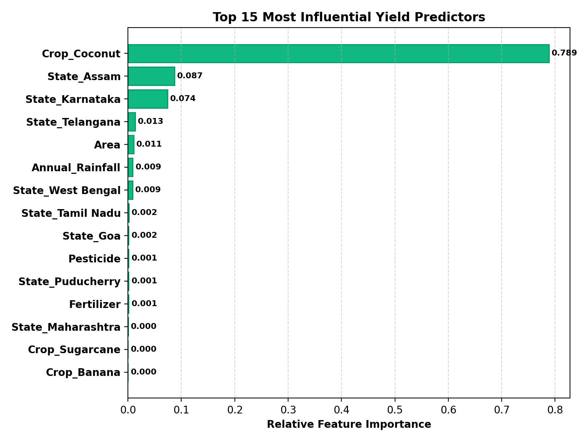

# AgriSmart AI – Crop Yield ML Evaluation Report

**Date**: 2026-09-12 19:09:38  
**Dataset**: `crop_yield.csv` (19,689 samples, 7 input features)  
**Primary Selection Metric**: **Lowest RMSE & MAE** (Validated with temporal holdout)

---

## 1. Dataset Audit & Problem Formulation

- **Origin**: Agricultural Crop Yield in Indian States Dataset (ICAR / Ministry of Agriculture telemetry)
- **Total Valid Records**: 19,689
- **Target Variable**: `Yield` (Continuous, metric tonnes per hectare / nuts/ha for coconut)
- **Features Used**:
  - **Categorical (3)**: `Crop`, `Season`, `State`
  - **Numerical (4)**: `Area`, `Annual_Rainfall`, `Fertilizer`, `Pesticide`
- **Validation Strategy**: **Time-Aware Temporal Split**
  - **Training Historical Period**: 1997 – 2016 (16,440 samples, 83.5%)
  - **Validation Future Period**: 2017 – 2020 (3,249 samples, 16.5%)
  - *No temporal lookahead leakage: models are strictly evaluated on unseen future harvest years.*

---

## 2. Data Leakage Checks & Mitigations

| Removed Feature / Item | Type | Agronomic Rationale & Leakage Mitigation |
|---|---|---|
| `Production` | Leakage / Non-Agronomic | Target-derived post-harvest leakage. Yield is mathematically calculated as Production / Area. Total harvested production is unknown prior to harvest and would cause severe lookahead leakage. |

---

## 3. Multi-Model Benchmark & Comparison

| Model | MAE | RMSE | R² | MAPE (%) | Fit Time (s) | Latency (ms/sample) |
|---|---|---|---|---|---|---|
| Linear Regression (Ridge) | 53.7618 | 309.6132 | 0.8657 | 3762.04% | 0.013s | 0.0ms |
| Random Forest | 11.6043 | 155.1490 | 0.9663 | 67.34% | 1.068s | 0.0082ms |
| Gradient Boosting | 12.2958 | 172.0178 | 0.9585 | 96.00% | 7.369s | 0.0019ms |
| **XGBoost** | **11.0826** | **149.3275** | **0.9687** | 67.55% | 1.855s | 0.0009ms |
| LightGBM | 15.8192 | 196.1556 | 0.9461 | 391.10% | 0.085s | 0.0014ms |

---

## 4. Best Model Performance: **XGBoost**

- **RMSE**: 149.3275
- **MAE**: 11.0826
- **R² Score**: 0.9687 (96.87% variance explained)
- **MAPE**: 67.55%
- **Inference Latency**: 0.0009 ms per sample

### Actual vs Predicted Analysis

### Residual Distribution Analysis

### Feature Importance

---

## 5. Serialization & Saved Pipeline

- **Trained Model Checkpoint**: `J:\AGRISMART_AI\models\yield\best_model.pkl`
- **ColumnTransformer Preprocessor**: `J:\AGRISMART_AI\models\yield\preprocessor.pkl`
- **Feature Configuration**: `J:\AGRISMART_AI\models\yield\feature_config.json`
- **Metadata**: `J:\AGRISMART_AI\models\yield\metadata.json`
