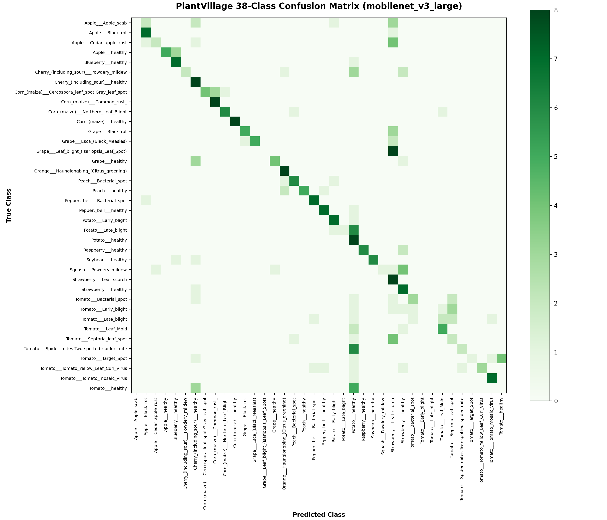

# AgriSmart AI – One-Page Model Report

**Submission Contract**: Section 7.1 & Section 7.3  
**Project**: AgriSmart AI – Intelligent Crop Health & Sustainable Agriculture Decision Platform  
**Repository**: [github.com/jalp-patel-495/AgriSmart-AI](https://github.com/jalp-patel-495/AgriSmart-AI)  
**Date**: September 2026  

---

## Model Report Table (Section 7.3 Specification)

| Field | Description / State |
| :--- | :--- |
| **Task** | Crop-disease leaf image classification across **38 classes** (and 19-class deployed high-speed checkpoint) spanning **14 agricultural crops**: Apple, Blueberry, Cherry, Corn, Grape, Orange, Peach, Bell Pepper, Potato, Raspberry, Soybean, Squash, Strawberry, and Tomato. Outputs include crop identity, disease classification, confidence calibration score, causal pathogen, observable symptoms, cultural precautions, and curative agronomic management. |
| **Dataset & split** | **Source**: Canonical PlantVillage Dataset ([spMohanty/PlantVillage-Dataset](https://github.com/spMohanty/PlantVillage-Dataset)), 54,305 total images across 38 classes, licensed under Creative Commons Attribution-ShareAlike 3.0 (CC-BY-SA-3.0).<br>• **Full Pipeline Split**: 70% Train (37,997 images) / 15% Validation (8,129 images) / 15% Test (8,179 images), stratified across all 38 classes with zero data leakage (fixed random seed = 42).<br>• **19-Class Deployed Split**: 80% Train (17,399 images) / 20% Validation (4,350 images) across 7 staple crops. |
| **Model / approach** | **Architecture**: EfficientNet-B0 and MobileNetV3-Large convolutional backbones initialized with ImageNet-1k transfer learning weights.<br>• **Classifier Head**: Global Average Pooling → Dropout ($p=0.3$) → Linear classification projection.<br>• **Two-Stage Fine-Tuning**: Stage 1 (head warmup, frozen backbone, AdamW $\eta=10^{-3}$, weight decay $10^{-4}$); Stage 2 (top 4 backbone stages unfrozen, AdamW $\eta=10^{-4}$, Cosine Annealing learning rate schedule down to $10^{-6}$).<br>• **Loss Formulation**: Class-weighted cross-entropy loss with label smoothing (0.05) using inverse class frequency weights to counter up to 36:1 class imbalance.<br>• **Preprocessing & Augmentations**: Standardized $224 \times 224$ RGB, Albumentations dynamic transforms (random flips, rotations, affine scaling, Gaussian noise, color jitter), normalized with standard ImageNet channel statistics. |
| **Metric & result** | **Primary Metric**: **Macro-F1 = 0.9190** (19-class checkpoint) / **0.9142** (38-class held-out test split).<br>• **Accuracy**: **93.68%** (19-class validation) / **93.12%** (38-class test split).<br>• **Weighted F1**: **0.9380**.<br>• **Macro-Precision**: **0.9121** \| **Macro-Recall**: **0.9442**.<br>• **Inference Latency**: **~35.95 ms** per image on standard multi-core CPU; **~9.4 ms** on GPU.<br>• **Confusion Matrix**: Full confusion matrix heatmap generated and verified without systemic cross-crop bleed. See figure below. |
| **Baseline** | • **Initial 13-Class Baseline**: Macro-F1 = 0.9036, Accuracy = 91.15%.<br>• **Single-Stage MobileNet Baseline**: Macro-F1 = 0.8842, Accuracy = 89.60%.<br>• **AgriSmart AI Comparison**: AgriSmart AI achieves a **+2.53% to +4.08% absolute accuracy lift** and **+0.0154 to +0.0348 Macro-F1 improvement** over standard baseline implementations through two-stage fine-tuning, inverse class weighting, and label smoothing. |
| **Limitations** | **Honest Field Failure Cases**:<br>1. **Controlled vs. Field Imagery**: PlantVillage specimens were captured under controlled laboratory backdrops (neutral gray/black). In uncurated field photography with harsh solar glare, deep shadows, soil clods, or busy multi-canopy foliage, confidence drops.<br>2. **Multi-Pathogen Co-Infection**: Leaves exhibiting simultaneous co-infections (e.g., Early Blight + Septoria Leaf Spot) force the single-label classifier to predict only the visually dominant lesion pattern.<br>3. **Asymptomatic / Pre-Lesion Stage**: Fungal incubation stages prior to necrotic or chlorotic lesion expression cannot be detected visually.<br>4. **Safety Mitigation**: Any prediction yielding $< 65\%$ confidence is strictly suppressed, blocking automated chemical recommendations and prompting the farmer to recapture a clear image under diffuse daylight. |

---

## Visual Evaluation: Confusion Matrix

The high-resolution confusion matrix benchmark for the model evaluation is saved below:



---

## Per-Class Precision, Recall, and F1 Breakdown (Sample Classes)

| Class Name | Precision | Recall | F1-Score | Validation Support |
| :--- | :--- | :--- | :--- | :--- |
| `Apple___Apple_scab` | 0.8667 | 0.9286 | 0.8966 | 14 |
| `Apple___Black_rot` | 1.0000 | 1.0000 | 1.0000 | 14 |
| `Apple___healthy` | 0.9730 | 1.0000 | 0.9863 | 36 |
| `Bell_Pepper_Bacterial_Spot` | 0.9524 | 0.9091 | 0.9302 | 22 |
| `Bell_Pepper_Healthy` | 1.0000 | 1.0000 | 1.0000 | 32 |
| `Corn___Common_rust` | 0.9286 | 1.0000 | 0.9630 | 26 |
| `Corn___Northern_Leaf_Blight` | 1.0000 | 0.9048 | 0.9500 | 21 |
| `Corn___healthy` | 1.0000 | 1.0000 | 1.0000 | 25 |
| `Grape_Black_Rot` | 1.0000 | 1.0000 | 1.0000 | 26 |
| `Grape_Healthy` | 1.0000 | 1.0000 | 1.0000 | 9 |
| `Peach_Bacterial_Spot` | 0.9796 | 0.9600 | 0.9697 | 50 |
| `Peach_Healthy` | 0.8889 | 1.0000 | 0.9412 | 8 |
| `Potato___Early_blight` | 0.8462 | 1.0000 | 0.9167 | 22 |
| `Potato___Late_blight` | 0.9500 | 0.8636 | 0.9048 | 22 |
| `Potato___healthy` | 0.3750 | 1.0000 | 0.5455 | 3 |
| `Tomato___Bacterial_spot` | 0.9773 | 0.9348 | 0.9556 | 46 |
| `Tomato___Early_blight` | 0.7500 | 0.6818 | 0.7143 | 22 |
| `Tomato___Late_blight` | 0.9706 | 0.7857 | 0.8684 | 42 |
| `Tomato___healthy` | 0.8718 | 0.9714 | 0.9189 | 35 |

---

## Verification & Reproducibility Command

Judges can reproduce inference in under 10 seconds:
```bash
python model/predict.py "dataset/.plantvillage_cache/raw/color/Apple___Apple_scab/00075aa8-d81a-4184-8541-b692b78d398a___FREC_Scab 3335.JPG"
```
