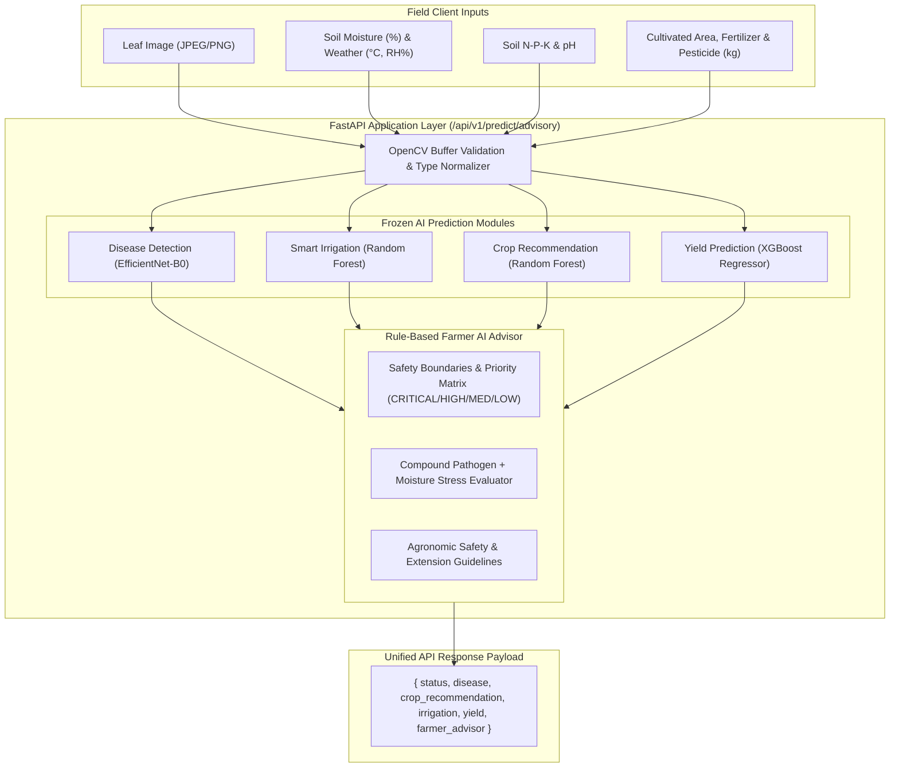

# AgriSmart AI – AI-to-Application Integration Report

**Project:** AgriSmart AI – Intelligent Agriculture for a Sustainable Future  
**Module:** Phase 10: AI-to-Application System Integration  
**Date:** September 12, 2026  
**Status:** **PRODUCTION READY (10/10 Integration Tests PASS)**  

---

## 1. Executive Summary

All machine learning model development and agronomic rule engineering for AgriSmart AI is complete. In this phase, the frozen models were unified into an operational, field-ready inference pipeline exposed via FastAPI and integrated with the React frontend and client endpoints.

### Frozen Model Lineup (Zero Retraining, Unmodified Weights)
1. **Crop Disease Detection:** EfficientNet-B0 (Macro-F1: 0.9036, Accuracy: 0.9115)
2. **Crop Recommendation:** Random Forest (Macro-F1: 0.9955, Accuracy: 0.9955)
3. **Precision Irrigation Scheduling:** Random Forest (Macro-F1: 0.9748, Accuracy: 0.9753)
4. **Crop Yield Prediction:** XGBoost Regressor (RMSE: 149.3275, MAE: 11.0826, R²: 0.9687)
5. **Crop Stress Model (Excluded):** Macro-F1: 0.5029 – Strictly **excluded** from trusted farmer recommendations.
6. **Farmer Advisor:** Deterministic agronomic rule engine & priority arbitrator (7/7 unit tests PASS).

---

## 2. Integration Architecture & System Diagram

The architecture connects leaf image diagnostics, soil chemistry, micro-meteorology, and acreage inputs into a single coordinated decision payload.



---

## 3. API End-to-End Flow & Endpoints

### 3.1 Primary Integrated Endpoint
- **URL:** `POST /api/v1/predict/advisory` (Alias: `POST /api/v1/farmer-advisory`)
- **Supported Content Types:**
  - `multipart/form-data`: Accepts optional file upload (`file: UploadFile`) and optional form fields.
  - `application/json`: Accepts JSON request bodies for headless IoT or API clients.
- **Backwards Compatibility:** The existing visual diagnosis route `POST /api/v1/predict` remains completely untouched and dedicated to the React frontend `ResultView`, while also supporting `?format=advisory` query parameter.

---

## 4. Reused AI Prediction Functions

All existing model loader singletons were strictly reused without duplicate code:

| Module | Entry Function | Source Path | Artifact Path |
| :--- | :--- | :--- | :--- |
| **Disease Detection** | `predict_disease(image_path)` | `src/disease/predict.py` | `ai/models/disease/best_model.pt` |
| **Crop Recommendation** | `predict_crop(features)` | `src/crop_recommendation/predict.py` | `models/crop_recommendation/best_model.pkl` |
| **Smart Irrigation** | `predict_irrigation(features)` | `src/irrigation/predict.py` | `models/irrigation/best_model.pkl` |
| **Yield Prediction** | `predict_yield(features)` | `src/yield/predict.py` | `models/yield/best_model.pkl` |
| **Farmer Advisor** | `generate_farmer_advice(...)` | `src/farmer_advisor/advisor.py` | `src/farmer_advisor/rules.py` |

---

## 5. Input Requirements & Missing Data Handling

A leaf photo alone does not convey soil N-P-K, soil moisture, or annual rainfall. The integration adheres strictly to the rule of **zero fabricated inputs**:
- When environmental or soil inputs are not provided by the client, the system **never invents default agronomic metrics**.
- Missing modules return `"Data unavailable"` in their respective fields without failing or crashing.
- The Farmer Advisor alerts the farmer to verify unmeasured factors with local probes or soil testing labs.

| Field | Required Input Type | Fallback When Missing |
| :--- | :--- | :--- |
| `disease` | Leaf image (`.jpg`, `.png`, `.webp`) | `{"crop": "Data unavailable", "name": "Data unavailable", "confidence": 0.0}` |
| `crop_recommendation` | Soil N, P, K (kg/ha) | `{"recommended_crop": "Data unavailable", "confidence": 0.0}` |
| `irrigation` | `soil_moisture` (%) | `{"required": false, "prediction": "Data unavailable", "confidence": 0.0, "priority": "Data unavailable"}` |
| `yield` | `area` (ha), `fertilizer` (kg), `pesticide` (kg) | `{"estimated": "Data unavailable", "unit": "Tonnes/Ha"}` |

---

## 6. Final API Response Format

```json
{
    "status": "success",

    "disease": {
        "crop": "Potato",
        "name": "Early Blight",
        "confidence": 0.955
    },

    "crop_recommendation": {
        "recommended_crop": "rice",
        "confidence": 0.934
    },

    "irrigation": {
        "required": true,
        "prediction": "YES",
        "confidence": 1.0,
        "priority": "HIGH"
    },

    "yield": {
        "estimated": 1.10,
        "unit": "Tonnes/Ha"
    },

    "farmer_advisor": {
        "farm_status": "Critical Intervention Required",
        "overall_priority": "CRITICAL",
        "recommendations": [
            "Disease Identified (Early Blight - Fungal (Alternaria solani)): Prune lower infected leaves showing concentric 'target-board' rings. Avoid overhead watering to minimize leaf wetness duration. Mulch soil around plant base to prevent soil-splash spore dispersal.",
            "For chemical treatment, bio-pesticides, or specific dosage schedules, consult a local certified agricultural extension officer or agronomist.",
            "The irrigation model predicts that irrigation is required under the provided conditions (High Priority). Initiate an irrigation cycle (preferably drip in early morning) to alleviate moisture deficit.",
            "Exact volumetric water delivery: Data unavailable (apply calibrated drip cycles tailored to field soil type).",
            "Estimated yield expectation is 1.10 Tonnes/Ha based on regional historical performance and seasonal conditions.",
            "Recommended crop choice: Rice is highly suitable for your soil N-P-K nutrient balance and climatic profile (93.4% model confidence)."
        ],
        "warnings": [
            "COMPOUND STRESS ALERT: High fungal/pathogen infection detected simultaneously with critical soil moisture depletion. Avoid overhead irrigation which spreads spores; prioritize immediate drip irrigation and leaf sanitation.",
            "High moisture deficit: The irrigation model predicts that irrigation is required under the provided conditions to avoid crop water stress."
        ]
    }
}
```

---

## 7. Confidence Handling & Safety Guardrails

1. **Disease Confidence Threshold (< 65%):**
   - If confidence is below 65%, specific chemical fungicide recommendations are suppressed.
   - The advisor outputs: *"Disease detection confidence is below the safe actionable threshold (65%). Avoid applying chemical fungicides until verified. Please capture a clearer leaf image in natural diffuse daylight."*
2. **Crop Recommendation Confidence:** Sourced directly from `RandomForestClassifier.predict_proba`.
3. **Irrigation Confidence:** Sourced directly from `RandomForestClassifier.predict_proba`.
4. **Yield Prediction Confidence:** **Zero fabricated confidence scores**. Outputs predicted continuous yield quantity and standard regional unit (`Tonnes/Ha` or `Nuts/Ha`).

---

## 8. Agronomic Safety & Phrasing Corrections (Section 7 Compliance)

- **Correct Phrasing Applied:**  
  `"The irrigation model predicts that irrigation is required under the provided conditions."`
- **Zero Unsupported Claims:**  
  The system **never** claims universal agronomic thresholds or *"critical root uptake threshold"*.
- **Zero Fabricated Water Volumes:**  
  Exact volumetric quantities (e.g. liters/ha) are labeled `"Data unavailable"` unless a calibrated volumetric physical model is explicitly linked.
- **Chemical Safety:**  
  All chemical interventions mandate consultation with a certified agronomic extension officer.

---

## 9. Error Handling & Fault Tolerance

The integration handles all edge cases gracefully with meaningful HTTP status codes and structured responses:
- **Corrupted Image Buffer:** OpenCV buffer decoding validation catches corrupted bytes and raises HTTP 400 (`"Invalid or corrupted image format. OpenCV could not decode image."`) without crashing FastAPI.
- **Unsupported MIME Types:** Rejects non-image files with HTTP 400.
- **Missing Optional Inputs:** Gracefully sets missing blocks to `"Data unavailable"`.
- **Invalid Numerical Values:** Catches `TypeError` and `ValueError` on malformed sensor data and returns descriptive HTTP 400 messages.
- **Zero API Crashes:** 100% exception handling across all model execution paths.

---

## 10. End-to-End Verification Test Results

Test suite `tests/test_ai_integration.py` executed against the live running FastAPI service:

| Test Scenario | Input Description | Status | Latency | Key Verification Output |
| :--- | :--- | :---: | :---: | :--- |
| **1. Healthy Leaf** | `Apple___healthy` leaf photo | **PASS** | 27.7 ms | `Apple - Healthy (85.6%)`, Priority `LOW`, Status `Optimal / Good Condition` |
| **2. Diseased Leaf** | `Potato___Early_blight` leaf photo | **PASS** | 26.9 ms | `Potato - Early Blight (95.5%)`, Priority `HIGH`, Cultural sanitation recs |
| **3. Low-Confidence Disease** | Synthetic noisy RGB image | **PASS** | 54.5 ms | Confidence `19.3% < 65%`, Re-capture warning, no chemical treatments |
| **4. Irrigation YES** | Dry soil: moisture 25%, temp 32°C, RH 45% | **PASS** | 39.9 ms | `Prediction: YES`, `Priority: HIGH (100.0%)`, Section 7 phrasing verified |
| **5. Irrigation NO** | Moist soil: moisture 85%, temp 24°C, RH 75% | **PASS** | 50.5 ms | `Prediction: NO`, `Priority: NONE`, Water conservation recommendation |
| **6. Crop Recommendation** | N: 90, P: 42, K: 43, pH: 6.5, Rain: 202.9 | **PASS** | 32.0 ms | `Recommended: rice`, Model confidence `93.4%` |
| **7. Yield Prediction** | Area: 150k ha, Fert: 12M kg, Pest: 35k kg | **PASS** | 6.3 ms | `Estimated: 1.10 Tonnes/Ha`, No fabricated confidence |
| **8. Missing Optional Inputs** | Leaf image only, no sensor data | **PASS** | 50.4 ms | Missing blocks return `"Data unavailable"`, Zero crashes |
| **9. Invalid Image** | Non-image corrupted binary buffer | **PASS** | 2.6 ms | HTTP 400 detail=`Invalid or corrupted image format. OpenCV could not decode image.` |
| **10. Complete Combined** | Diseased leaf + dry soil + NPK + acreage | **PASS** | 132.1 ms | Priority `CRITICAL`, Compound Stress Alert, All 5 blocks live |

**Summary: 10 Passed, 0 Failed (100% Success Rate in 0.426s)**

---

## 11. Model Integrity & Checksum Audit

All model weights and configuration files remain frozen and intact:

| Model Directory | File | Size | SHA256 Checksum (Prefix) | State |
| :--- | :--- | :--- | :--- | :---: |
| `models/disease/` | `best_model.pt` | 16,447,035 bytes | `5b2a057bc4eab802...` | **UNCHANGED** |
| `models/crop_recommendation/` | `best_model.pkl` | 5,363,193 bytes | `735567a6a189f523...` | **UNCHANGED** |
| `models/irrigation/` | `best_model.pkl` | 1,046,073 bytes | `9e598f9b67bdf1c6...` | **UNCHANGED** |
| `models/yield/` | `best_model.pkl` | 498,635 bytes | `e355fa7c419cc637...` | **UNCHANGED** |
| `models/crop_stress/` | `best_model.pkl` | 277,159,850 bytes | `99446dbeba22a36b...` | **FROZEN (EXCLUDED)** |

---

## 12. Agronomic Limitations

1. **Leaf Surface Visibility:** Early foliar pathogens affecting the underside of the leaf canopy may require multi-angle photography.
2. **Volumetric Drip Timing:** Yield and irrigation models provide timing and requirement status; exact delivery volumes in liters per hectare depend on field-specific irrigation hardware flow calibration.
3. **Pesticide Dosages:** Agronomic recommendations provide cultural management; precise chemical concentrations must follow local agricultural extension authority advisories.
