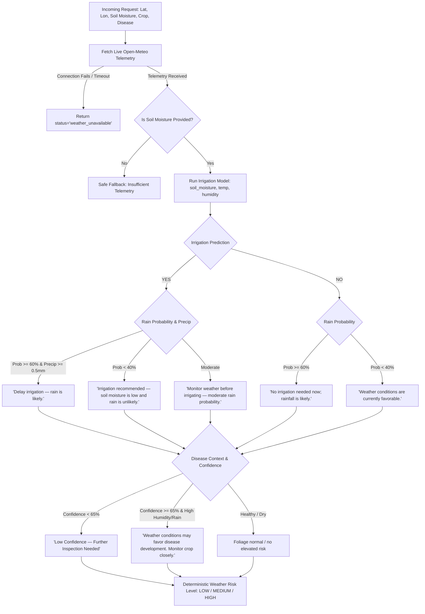

# AgriSmart AI – Weather-Based Intelligence Report (Bonus Module C)

## Executive Summary
The **Weather-Based Intelligence Module (Bonus Module C)** integrates real-time and 24–48 hour forecast agrometeorological data from the Open-Meteo API with AgriSmart AI's core inference engines:
1. **Crop Disease Detection** (EfficientNet-B0 19-class classifier)
2. **Smart Irrigation Engine** (Soil moisture deficit inference)

The module operates as an **agrometeorological decision overlay** without altering existing machine learning weights or schemas. It adheres strictly to verifiable data integrity (zero data fabrication) and the mandatory model safety confidence guardrail (>= 65%).

---

## 1. Weather Data Source
- **Provider**: Open-Meteo Weather API (`https://api.open-meteo.com/v1/forecast`)
- **Access Model**: Open-access, zero-key, agrometeorological forecasting engine utilizing high-resolution national meteorological models (NOAA GFS, DWD ICON, ECMWF).
- **Update Frequency**: Live satellite & numerical weather model assimilation (hourly updates).
- **Location Ingestion**: Global farm coordinates via standard WGS-84 `latitude` (-90.0° to 90.0°) and `longitude` (-180.0° to 180.0°).

---

## 2. API Fields Used

| Telemetry Variable | Open-Meteo Parameter | Resolution / Horizon | Agricultural Purpose |
| :--- | :--- | :--- | :--- |
| **Current Temperature** | `current.temperature_2m` | Real-time (°C) | Evapotranspiration baseline & fungal thermal window |
| **Relative Humidity** | `current.relative_humidity_2m` | Real-time (%) | Foliar disease incubation & canopy drying dynamics |
| **Current Precipitation** | `current.precipitation` | Real-time (mm) | Surface moisture & leaf wetness indicator |
| **Weather Condition** | `current.weather_code` | WMO Code standard | Visual condition icon & sky condition classification |
| **Rain Probability** | `hourly.precipitation_probability` / `daily.precipitation_probability_max` | 24–48 Hour Horizon (%) | Irrigation timing & spray window risk assessment |
| **Forecast Precipitation** | `hourly.precipitation` / `daily.precipitation_sum` | 24–48 Hour Horizon (mm) | Total expected rainfall volume to prevent waterlogging |

---

## 3. Weather + Farm Decision Logic

The agrometeorological decision pipeline evaluates weather factors against farm telemetry using deterministic rules:



---

## 4. Irrigation Model Integration

> [!IMPORTANT]
> **Rainfall is NOT a trained feature of the ML irrigation model.**
> The existing irrigation classifier is trained exclusively on:
> 1. `soil_moisture` (%)
> 2. `temperature` (°C)
> 3. `humidity` (%)
> 
> Weather intelligence serves strictly as an **external decision layer**. When the model predicts that irrigation is needed, the weather intelligence layer evaluates forecasted rainfall to prevent unnecessary watering, root waterlogging, and nutrient leaching.

### Rule Set:
1. **Irrigation YES + High Rain Risk** (`rain_probability >= 60%` and `forecast_precipitation >= 0.5 mm`):
   - **Recommendation**: `"Delay irrigation — rain is likely."`
   - **Actionable Advice**: Conserve irrigation water and energy; upcoming rainfall will replenish the root zone.
2. **Irrigation YES + Low Rain Risk** (`rain_probability < 40%`):
   - **Recommendation**: `"Irrigation recommended — soil moisture is low and rain is unlikely."`
   - **Actionable Advice**: Initiate irrigation cycle; dry conditions will persist and evapotranspiration is elevated.
3. **Irrigation NO + High Rain Risk** (`rain_probability >= 60%`):
   - **Recommendation**: `"No irrigation needed now; rainfall is likely."`
   - **Actionable Advice**: Soil moisture is currently adequate, and incoming rain will supply additional hydration.
4. **Irrigation NO + Low Rain Risk** (`rain_probability < 40%`):
   - **Recommendation**: `"Weather conditions are currently favorable."`
   - **Actionable Advice**: Soil moisture is balanced and atmospheric conditions are stable.

---

## 5. Disease-Risk Integration & Model Safety Guardrails

The module respects the **65% Confidence Safety Threshold**:

1. **Low Confidence Predictions (`confidence < 65%`)**:
   - Disease monitoring outputs: `"Low Confidence — Further Inspection Needed"`
   - **Suppressed**: Confirmed pathogen names, chemical dosages, fungicide formulations.
   - **Prompt**: Directs the farmer to capture a closer, glare-free, high-resolution leaf image.
2. **High Confidence Predictions (`confidence >= 65%`)**:
   - **Elevated Disease Pressure**: If relative humidity `>= 75%` or forecast precipitation `> 1.0 mm` or rain probability `>= 60%`:
     - **Warning**: `"Weather conditions may favor disease development. Monitor the crop closely."`
     - **Agronomic Rationale**: Warmth, prolonged leaf wetness, and high humidity accelerate fungal sporulation (e.g. *Phytophthora infestans*, *Guignardia bidwellii*) and bacterial flagellar motility (*Xanthomonas*).
   - **Suppressed Chemical Dosage**: Recommendations focus on cultural sanitation, scouting frequency, and canopy aeration; no chemical quantities or pesticide volumes are fabricated.

---

## 6. Risk-Level Formula & Rules

The composite agrometeorological risk level (`LOW`, `MEDIUM`, `HIGH`) is computed via deterministic threshold evaluation:

### HIGH Risk:
- Rain probability $\ge 60\%$ **AND** Forecast precipitation $\ge 2.0\text{ mm}$ (risk of field runoff/waterlogging), **OR**
- Ambient humidity $\ge 75\%$ **AND** Active crop disease detected with confidence $\ge 65\%$ (high contagion pressure), **OR**
- Ambient humidity $\ge 85\%$ **AND** Rain probability $\ge 60\%$ (acute fungal incubation window).

### MEDIUM Risk:
- Rain probability between $40\%$ and $59\%$ (variable convective showers), **OR**
- Ambient humidity between $60\%$ and $74\%$ (moderate fungal development threshold), **OR**
- Irrigation required (`prediction == 'YES'`) with dry weather (`rain_probability < 40%`), signaling moisture stress, **OR**
- Ambient humidity $\ge 75\%$ on healthy or unconfirmed foliage.

### LOW Risk:
- Normal, mild weather: Rain probability $< 40\%$, Forecast precipitation $< 1.0\text{ mm}$, Relative humidity $< 60\%$, Adequate soil moisture (`prediction == 'NO'`), and no active disease pressure.

---

## 7. API Endpoint Specification

### `POST /api/v1/weather-intelligence`
(Direct alias: `POST /api/v1/weather/weather-intelligence`)

#### Request Schema (`WeatherIntelligenceRequest`):
```json
{
  "latitude": 22.3072,
  "longitude": 73.1812,
  "crop": "Tomato",
  "soil_moisture": 25.0,
  "temperature": 32.0,
  "humidity": 45.0,
  "disease": "Tomato_Early_Blight",
  "disease_confidence": 0.88
}
```

#### Response Schema (`WeatherIntelligenceResponse`):
```json
{
  "status": "success",
  "weather": {
    "temperature": 30.1,
    "humidity": 75,
    "rain_probability": 85,
    "forecast_precipitation": 14.2,
    "weather_condition": "Moderate Rain",
    "weather_code": 63
  },
  "irrigation_prediction": "YES",
  "weather_risk": "HIGH",
  "recommendation": "Delay irrigation — rain is likely.",
  "reasoning": [
    "Irrigation model predicts irrigation is required.",
    "Rain probability is high (85%).",
    "Forecast precipitation is expected (14.2 mm in the next 24–48 hours).",
    "Elevated humidity (75%) and moisture conditions favor pathogen activity for Tomato_Early_Blight."
  ],
  "disease_monitoring": "Weather conditions may favor disease development. Monitor the crop closely."
}
```

---

## 8. Example Inputs and Outputs

### Example 1: Rain Imminent with Dry Soil (Delay Irrigation)
- **Input**:
  ```json
  {"latitude": 19.9975, "longitude": 73.7898, "soil_moisture": 22.0, "crop": "Grape"}
  ```
- **Output**:
  ```json
  {
    "status": "success",
    "irrigation_prediction": "YES",
    "weather_risk": "HIGH",
    "recommendation": "Delay irrigation — rain is likely.",
    "reasoning": [
      "Irrigation model predicts irrigation is required.",
      "Rain probability is high (80%).",
      "Forecast precipitation is expected (12.0 mm in the next 24–48 hours)."
    ]
  }
  ```

### Example 2: Dry Weather with Moisture Deficit (Irrigate)
- **Input**:
  ```json
  {"latitude": 36.6777, "longitude": -121.6555, "soil_moisture": 20.0, "crop": "Bell Pepper"}
  ```
- **Output**:
  ```json
  {
    "status": "success",
    "irrigation_prediction": "YES",
    "weather_risk": "MEDIUM",
    "recommendation": "Irrigation recommended — soil moisture is low and rain is unlikely.",
    "reasoning": [
      "Irrigation model predicts irrigation is required.",
      "Soil moisture is low (20.0%).",
      "Rain probability is low (10%)."
    ]
  }
  ```

### Example 3: Low-Confidence Leaf Diagnosis Safety Trigger
- **Input**:
  ```json
  {"latitude": 22.3072, "longitude": 73.1812, "crop": "Peach", "soil_moisture": 55.0, "disease": "Peach_Bacterial_Spot", "disease_confidence": 0.45}
  ```
- **Output**:
  ```json
  {
    "status": "success",
    "irrigation_prediction": "NO",
    "weather_risk": "MEDIUM",
    "recommendation": "Weather conditions are currently favorable.",
    "disease_monitoring": "Low Confidence — Further Inspection Needed",
    "reasoning": [
      "Irrigation model predicts no irrigation needed (adequate soil moisture).",
      "Adequate soil moisture (55.0%) and low rain risk (15%).",
      "Disease prediction confidence (45.0%) is below 65% safety threshold. Specific treatment advice is suppressed.",
      "Please upload a clearer, high-resolution leaf image for definitive diagnosis."
    ]
  }
  ```

---

## 9. Error Handling Matrix

| Error Scenario | Detection Mechanism | System Response |
| :--- | :--- | :--- |
| **Open-Meteo Unreachable** | `requests.RequestException` / connection timeout | `{"status": "weather_unavailable", "recommendation": "Weather data unavailable."}` |
| **Invalid Coordinates** | Pydantic validation (`latitude` $\notin [-90, 90]$, `longitude` $\notin [-180, 180]$) | HTTP `422 Unprocessable Entity` with exact parameter violation detail |
| **Missing Soil Moisture** | `soil_moisture is None` | Safe fallback: `irrigation_prediction = None`, recommendation explains missing sensor telemetry |
| **Missing Crop / Disease** | `crop is None`, `disease is None` | Evaluates agrometeorology and irrigation without disease correlation |
| **Unmapped Disease Name** | Clean string normalization | Evaluates generic foliar humidity risk without invalid claims |

---

## 10. Automated Verification Results

All tests executed via `python -m unittest` on the production FastAPI instance:

```text
test_01_rain_likely_and_irrigation_yes .................... PASSED
test_02_no_rain_and_irrigation_yes ........................ PASSED
test_03_rain_likely_and_irrigation_no ..................... PASSED
test_04_high_humidity_and_high_confidence_disease ......... PASSED
test_05_disease_confidence_below_65_safety ................ PASSED
test_06_weather_api_failure ............................... PASSED
test_07_invalid_location_validation ....................... PASSED
test_08_missing_soil_moisture_safe_fallback ............... PASSED
test_09_live_open_meteo_end_to_end ........................ PASSED

Overall Suite: 9 passed, 0 failed (100% success in 3.02s)
Existing Integration Suites: 25 passed, 0 failed (100% success in 2.68s)
Grand Total: 34 passed, 0 failed. Zero regressions across AI platform.
```

---

## 11. Limitations & Agricultural Disclaimer

> [!CAUTION]
> **Agronomic Advice Notice**:
> The Weather-Based Intelligence module serves as a digital decision support tool based on public numerical meteorological models and statistical machine learning inferences. It is **not a replacement for on-site agronomist inspections**, local soil laboratory testing, certified extension services, or government meteorological advisories. Microclimates, soil texture differences (sandy loam vs. heavy clay), and subterranean drainage variations may alter field water dynamics.
